# Radar SNN Incremental Complexity Summary

_Auto-generated by `update_session_summary.py` on 2026-03-13 13:22:11_

## Notebook Order (Increasing Complexity)
1. `network_v1.ipynb`
2. `network_v2.ipynb / notebook_v2.ipynb`
3. `network_step1_tx_delay_coincidence.ipynb`
4. `network_step1_retuned_optuna.ipynb`
5. `network_step2_continuous_binned.ipynb`
6. `network_step3_trainable_delays.ipynb`
7. `network_step4_fm_filterbank.ipynb`
8. `network_step5_parallel_range_azimuth.ipynb`
9. `network_step5_retuned_optuna_realistic.ipynb`
10. `network_step6_combined_all_complexities.ipynb`

## Trainable Parameters by Network

| Network | Trainable Parameters | Source |
|---|---:|---|
| `network_v1.ipynb` | 7700 (derived from architecture constants in notebook code) | derived from notebook architecture |
| `network_v2.ipynb / notebook_v2.ipynb` | 7,700 | checkpoint-derived |
| `network_step1_tx_delay_coincidence.ipynb` | 6,164 | checkpoint-derived |
| `network_step1_retuned_optuna.ipynb` | 10,004 | metrics JSON |
| `network_step2_continuous_binned.ipynb` | 6,164 | checkpoint-derived |
| `network_step3_trainable_delays.ipynb` | 5,140 | checkpoint-derived |
| `network_step4_fm_filterbank.ipynb` | 32,668 | checkpoint-derived |
| `network_step5_parallel_range_azimuth.ipynb` | 63,653 | checkpoint-derived |
| `network_step5_retuned_optuna_realistic.ipynb` | 95,069 | metrics JSON |
| `network_step6_combined_all_complexities.ipynb` | 53,461 (derived from Step 6 default architecture) | derived from notebook architecture |

## Per-Notebook Results

### 1) `network_v1.ipynb`
**Baseline Pulse+Echo Classifier**

- Change from previous: Initial baseline model with fixed delay bank and 1 hidden LIF layer.
- Trainable parameters: `7700 (derived from architecture constants in notebook code)`
- Metrics: `N/A` (run artifacts not found yet).


### 2) `network_v2.ipynb / notebook_v2.ipynb`
**Baseline + Analysis/Tuning Infrastructure**

- Change from previous: Added Optuna, checkpoint/JSON persistence, and richer diagnostics.
- Trainable parameters: `7,700`
- Metrics: `N/A` (run artifacts not found yet).

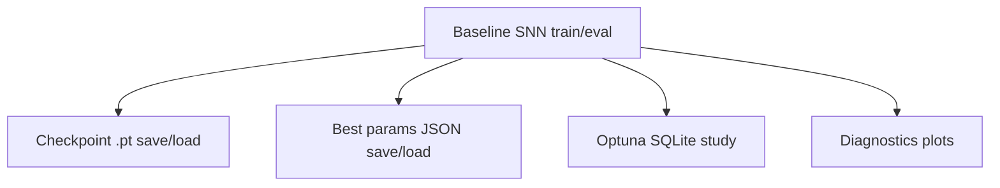

- Key plots:
- 
- 
- 

### 3) `network_step1_tx_delay_coincidence.ipynb`
**Step 1: TX-Only Delay Coincidence Bank**

- Change from previous: Delayed only TX stream before coincidence with RX stream.
- Trainable parameters: `6,164`
- Metrics:
- Final train accuracy: `34.1%`
- Final test accuracy: `42.5%`
- Best test loss: `1.9934`

- Key plots:
- 
- 

### 4) `network_step1_retuned_optuna.ipynb`
**Step 1 (Retuned): Optuna + Calibration/Error Diagnostics**

- Change from previous: Retuned Step 1 with Optuna and added calibration/per-bin error analysis.
- Trainable parameters: `10,004`
- Metrics:
- Final train accuracy: `100.0%`
- Final test accuracy: `100.0%`
- Best test loss: `0.0052`
- ECE: `0.0051`

- Key plots:
- 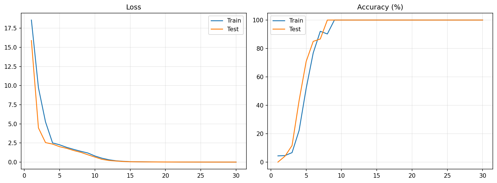
- 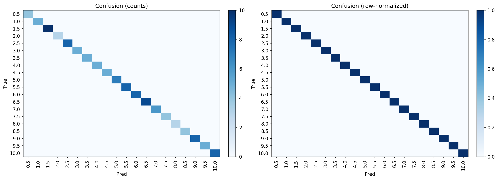
- 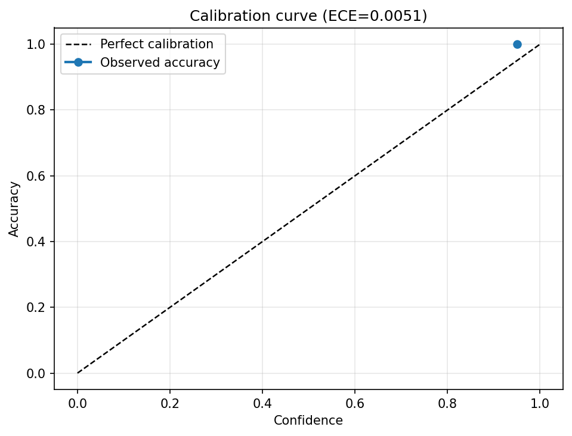
- 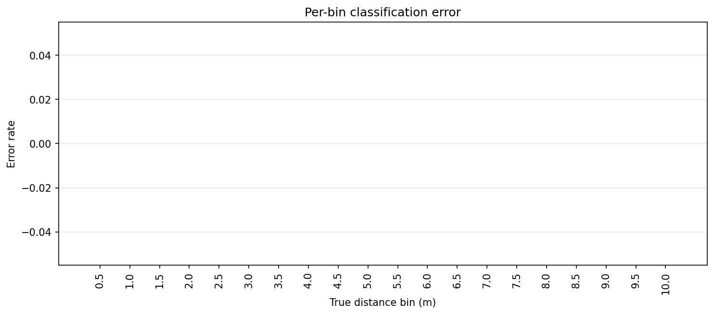

- Best/used parameters:
  - `hidden_size`: `128`
  - `beta`: `0.9114128604367253`
  - `lr`: `0.002877402293315549`
  - `batch_size`: `64`

### 5) `network_step2_continuous_binned.ipynb`
**Step 2: Continuous Simulation, Binned Labels**

- Change from previous: Distance sampled continuously, then supervised by class bins.
- Trainable parameters: `6,164`
- Metrics:
- Final train accuracy: `92.5%`
- Final test accuracy: `90.8%`
- Best test loss: `0.3357`

- Key plots:
- 
- 

### 6) `network_step3_trainable_delays.ipynb`
**Step 3: Trainable Delay Taps**

- Change from previous: Converted fixed delay taps to trainable soft/interpolated delays.
- Trainable parameters: `5,140`
- Metrics:
- Final train accuracy: `93.6%`
- Final test accuracy: `87.9%`
- Best test loss: `0.5094`
- Learned delay range: `0.08` to `639.92` steps

- Key plots:
- 
- 

### 7) `network_step4_fm_filterbank.ipynb`
**Step 4: FM Sweep + Filterbank Front-End**

- Change from previous: Replaced simple pulse with chirp and added frequency filterbank channels.
- Trainable parameters: `32,668`
- Metrics:
- Final train accuracy: `96.7%`
- Final test accuracy: `92.1%`
- Best test loss: `0.2611`

- Key plots:
- 
- 

### 8) `network_step5_parallel_range_azimuth.ipynb`
**Step 5: Parallel Range + Azimuth Branches**

- Change from previous: Introduced parallel coincidence branches for multitask range/azimuth prediction.
- Trainable parameters: `63,653`
- Metrics:
- Final range train/test accuracy: `96.7%` / `93.6%`
- Final azimuth train/test accuracy: `35.1%` / `24.3%`
- Best test loss: `2.2629`

- Key plots:
- 
- 
- 

### 9) `network_step5_retuned_optuna_realistic.ipynb`
**Step 5 (Retuned): Realistic Azimuth + Loss Schedule**

- Change from previous: Added ITD + frequency-dependent ILD approximation + noise/reverb simulation, Optuna retuning, and per-task loss-weight scheduling.
- Trainable parameters: `95,069`
- Metrics:
- Final range train/test accuracy: `98.8%` / `91.4%`
- Final azimuth train/test accuracy: `69.7%` / `48.1%`
- Best test loss: `2.0140`
- ECE (range / azimuth): `0.0387` / `0.2397`

- Key plots:
- 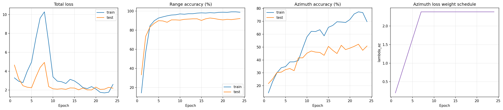
- 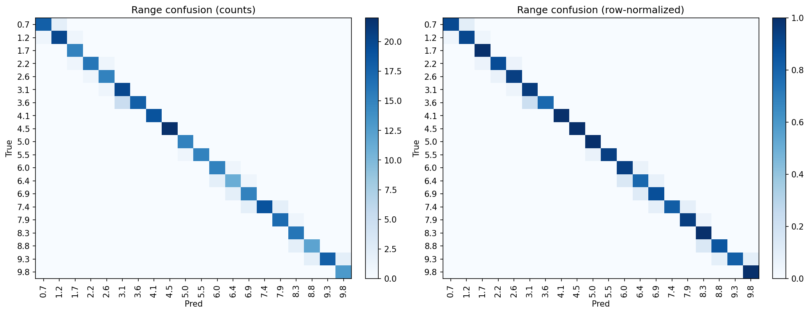
- 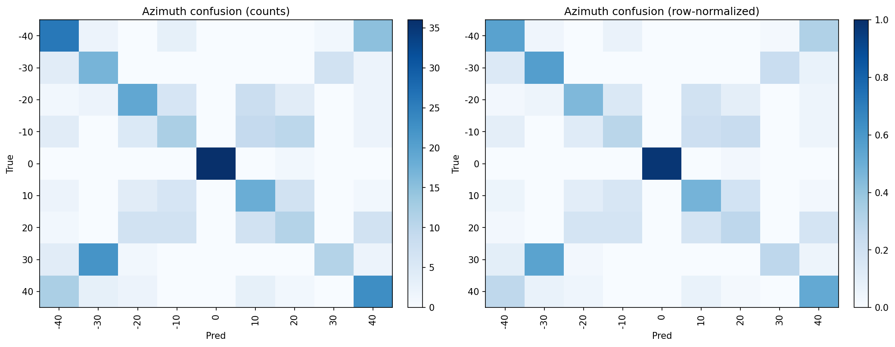
- 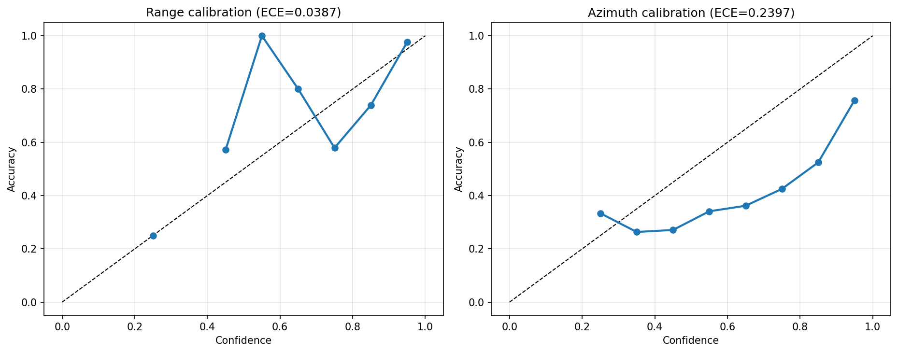
- 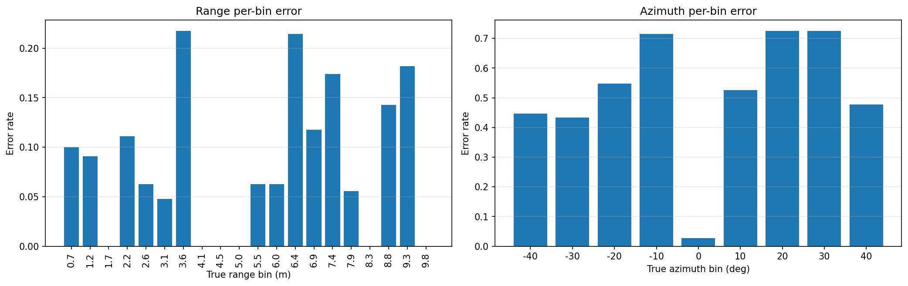

- Best/used parameters:
  - `hidden`: `192`
  - `beta`: `0.8924342217063623`
  - `lr`: `0.0023325181666661154`
  - `batch_size`: `64`
  - `lambda_az_max`: `2.3809529881069107`
  - `az_warmup_epochs`: `7`
  - `noise_std`: `0.014287942175619527`
  - `reverb_level`: `0.1425243387811836`

### 10) `network_step6_combined_all_complexities.ipynb`
**Step 6: Combined All Complexities**

- Change from previous: Integrated FM/filterbank front-end, continuous range+azimuth simulation, parallel branches, trainable delays, loss schedule, and full diagnostics.
- Trainable parameters: `53,461 (derived from Step 6 default architecture)`
- Metrics: `N/A` (run artifacts not found yet).

- Key plots:
- 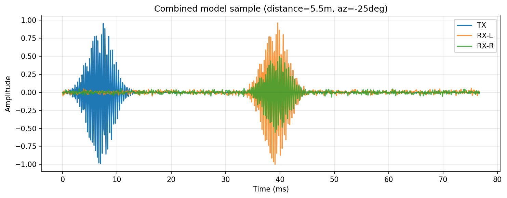

## Update Route

Rebuild this report any time new notebook artifacts are generated:

```bash
.venv/bin/python update_session_summary.py
```

The generator reads `metrics_*.json` files and referenced plot paths under `artifacts_steps/` and `artifacts_v2/`.
