# Radar SNN Incremental Complexity Summary

This report summarizes the notebook sequence implemented in this session, from baseline through increasing architectural/simulation complexity.

## Notebook Order (Increasing Complexity)

1. `network_v1.ipynb` - baseline pulse+echo classifier.
2. `network_v2.ipynb` - baseline + experiment/analysis framework (Optuna, checkpointing, richer plots).
3. `network_step1_tx_delay_coincidence.ipynb` - true TX-delayed coincidence bank.
4. `network_step2_continuous_binned.ipynb` - continuous distance simulation, binned supervision.
5. `network_step3_trainable_delays.ipynb` - trainable delay taps.
6. `network_step4_fm_filterbank.ipynb` - FM sweep TX + frequency filterbank.
7. `network_step5_parallel_range_azimuth.ipynb` - dual parallel branches for range + azimuth.

---

## 1) `network_v1.ipynb`

**Change from previous:** initial baseline (no prior).

**Notes:**
- Fast baseline for proving trainability.
- Uses ideal/no-noise deterministic data.

---

## 2) `network_v2.ipynb` / `notebook_v2.ipynb`

**Change from `network_v1`:** architecture mostly unchanged; analysis and experiment management substantially upgraded.

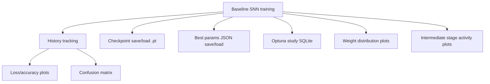

**Added functionality:**
- Optuna integration with SQLite storage.
- Dashboard launch helper.
- Reusable `.pt` checkpoint and `.json` best-parameter persistence.
- Plot auto-saving under `artifacts_v2/plots/`.

**Current metrics (from checkpoint history):**
- Final train accuracy: `100.0%`
- Final test accuracy: `100.0%`
- Best test accuracy observed: `100.0%`

**Key plots:**
- 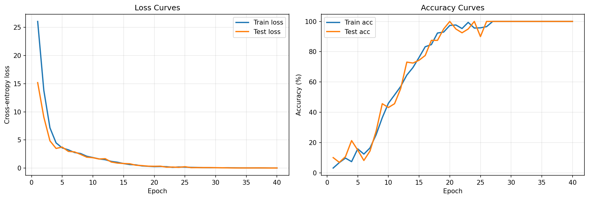
- 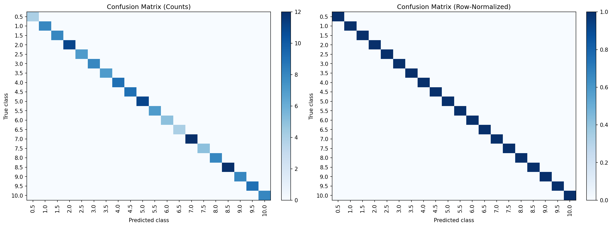
- 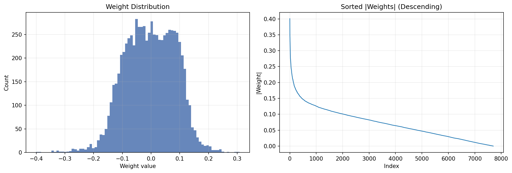

---

## 3) `network_step1_tx_delay_coincidence.ipynb`

**Change from `network_v2`:** implemented true coincidence logic by delaying only TX stream and correlating with RX stream.

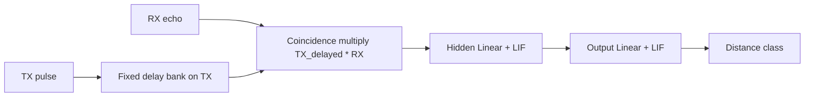

**Observed metrics:**
- Final train accuracy: `34.1%`
- Final test accuracy: `42.5%`
- Best test loss: `1.9934`

**Comment:**
- This branch was harder than baseline under current hyperparameters; it is the right structural direction but needs retuning and possibly stronger supervised signal/noise model.

**Key plots:**
- 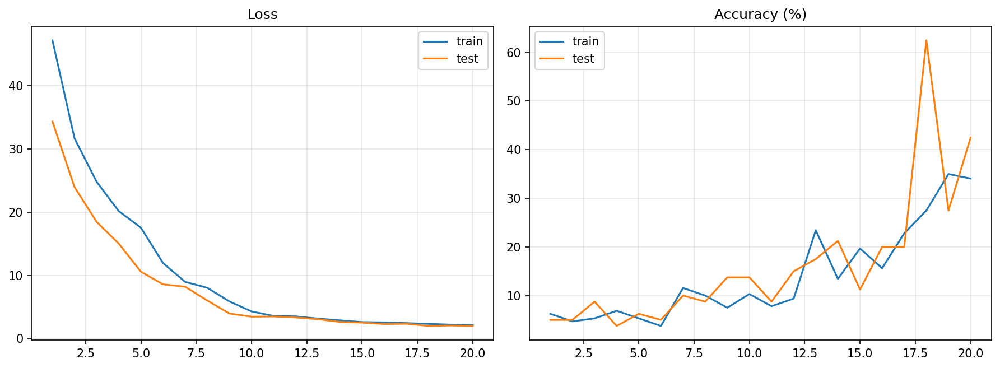
- 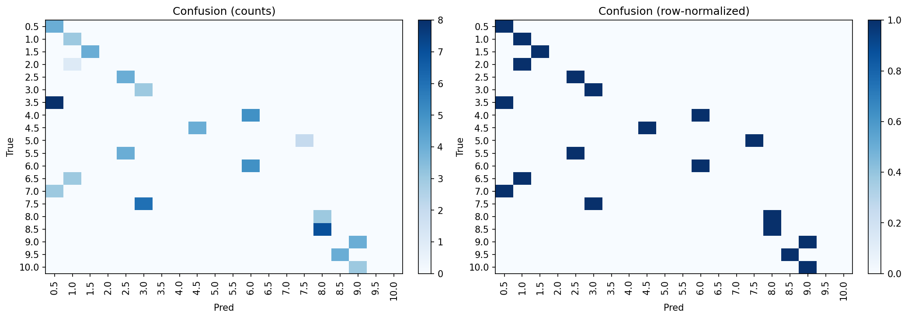

---

## 4) `network_step2_continuous_binned.ipynb`

**Change from Step 1:** distance generation became continuous, labels assigned by bins.

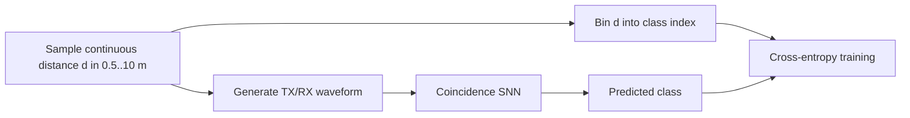

**Observed metrics:**
- Final train accuracy: `92.5%`
- Final test accuracy: `90.8%`
- Best test loss: `0.3357`

**Comment:**
- Major jump in robustness/performance versus Step 1 despite harder simulation realism.

**Key plots:**
- 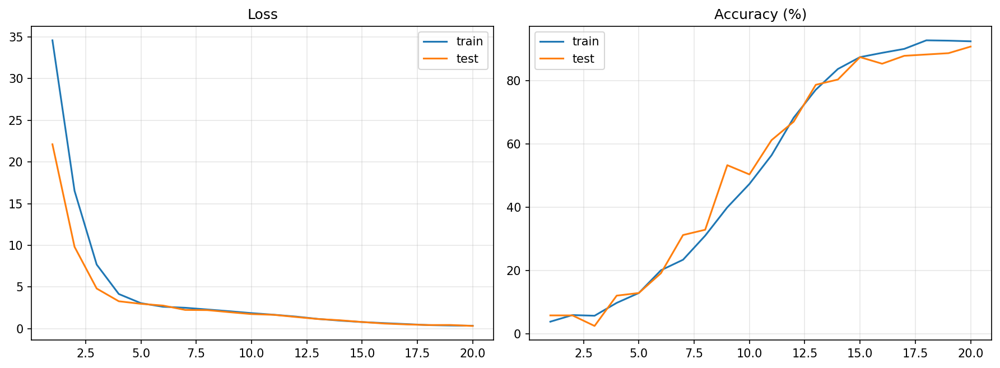
- 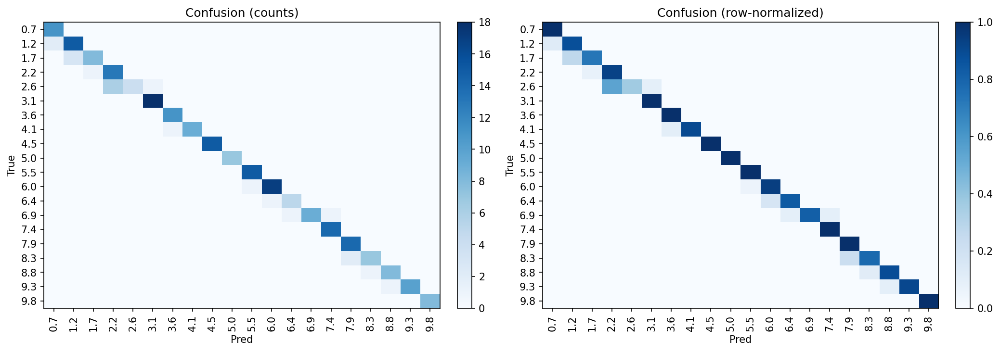

---

## 5) `network_step3_trainable_delays.ipynb`

**Change from Step 2:** replaced fixed delay taps with trainable soft/interpolated delay parameters.

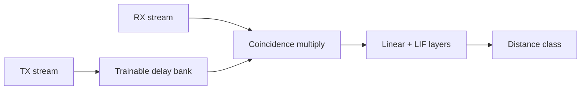

**Observed metrics:**
- Final train accuracy: `93.6%`
- Final test accuracy: `87.9%`
- Learned delay range: `0.08` to `639.92` steps
- Best test loss: `0.5094`

**Comment:**
- Trainable delays worked and remained in plausible range, but did not outperform Step 2 with current settings.

**Key plots:**
- 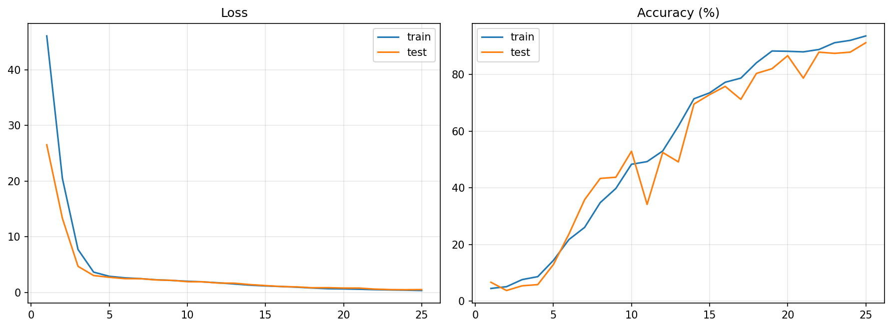
- 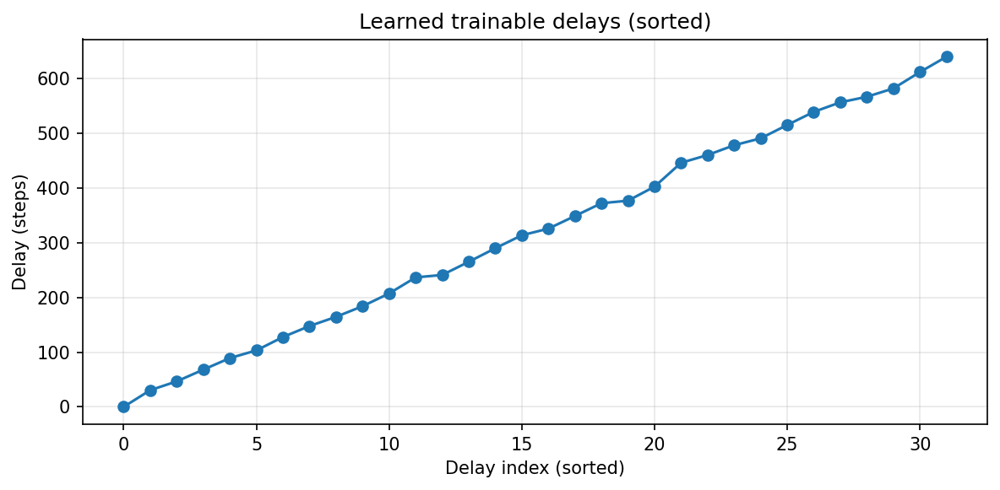

---

## 6) `network_step4_fm_filterbank.ipynb`

**Change from Step 3:** switched TX waveform to high-to-low FM chirp and inserted fixed frequency filterbank before coincidence.

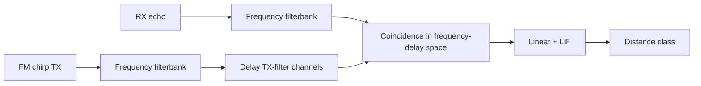

**Observed metrics:**
- Final train accuracy: `96.7%`
- Final test accuracy: `92.1%`
- Best test loss: `0.2611`

**Comment:**
- FM + filterbank improved over Step 3 in this run and is a strong basis for richer echo discrimination.

**Key plots:**
- 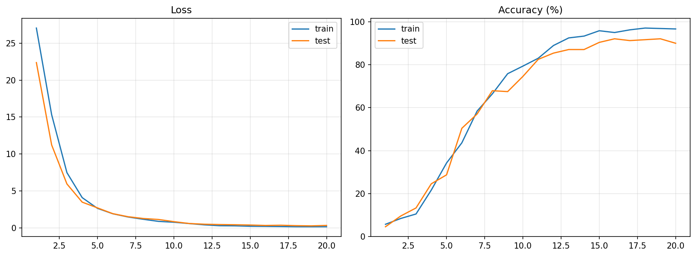
- 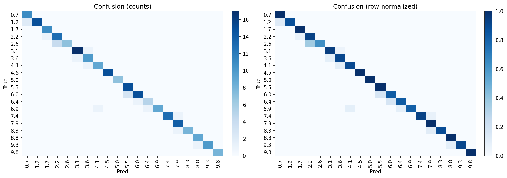

---

## 7) `network_step5_parallel_range_azimuth.ipynb`

**Change from Step 4:** introduced two parallel coincidence branches for multitask prediction:
- Range branch
- Azimuth branch (binaural difference cues)

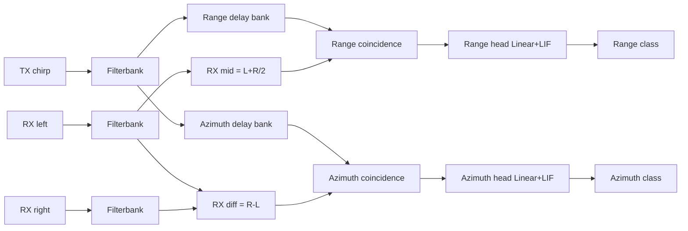

**Observed metrics:**
- Range final train/test accuracy: `96.7%` / `93.6%`
- Azimuth final train/test accuracy: `35.1%` / `24.3%`
- Best total test loss: `2.2629`

**Comment:**
- Range branch is strong; azimuth branch remains the bottleneck and needs better spatial cue simulation/features/loss balancing.

**Key plots:**
- 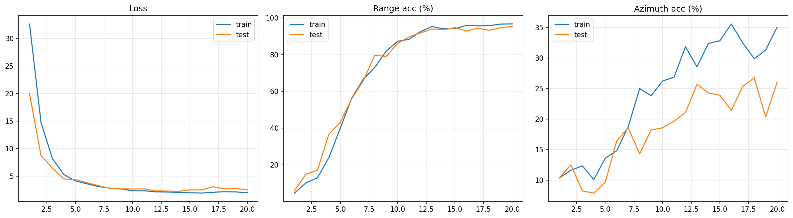
- 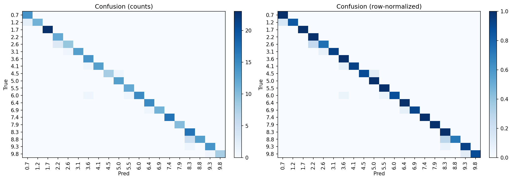
- 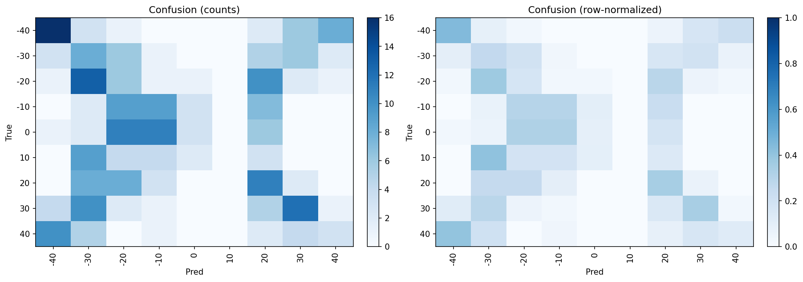

---

## Practical Next Moves

1. Retune Step 1 and Step 5 with Optuna (now easy via `network_v2` infrastructure patterns).
2. Improve azimuth simulation realism (ITD + frequency-dependent ILD + noise/reverb).
3. Add per-task loss weighting schedule in Step 5.
4. Add calibration plots (confidence vs correctness) and per-bin error histograms.